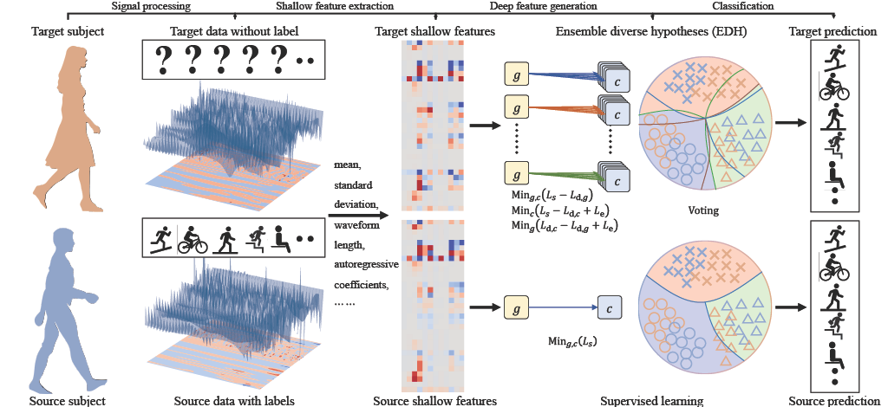

## Ensemble diverse hypotheses and knowledge distillation for unsupervised cross-subject adaptation



This is the implementation of Unsupervised Cross-subject Adaptation for Predicting Human Locomotion Intent in Pytorch.

## Getting Started
### Installation
```
pip install -r requirements.txt
```

### Download dataset
Download the dataset and checkpoint from the [model_and_data_link](https://1drv.ms/u/s!AsabHXP6_OvSg_0mH-8h7FC97kcyqQ?e=Wq57XW):

Extract the model and data to the root folder of EDH project. Follow the folder structure below:
```
-checkpoint
    -EDHKD********.pt
    -*****
-data
    -DSADS
        -pseudo_dataset
            -0_sensor_0.npy
            -***
        -0.mat
        -***
    -ENABL3S
        -pseudo_dataset
            -0_sensor_0.npy
            -***
        -AB_0.mat
        -***
```

### Test
```
python main.py --eval_only True
```

### Train
```
python main.py --eval_only False
```

## Contact

For more related works and codes, please view my homepage: https://sites.google.com/view/kuangenzhang

Further information please contact Kuangen Zhang (kuangen@student.ubc.ca).

## Citation
If you find our work useful in your research, please consider citing:
```bash
@article{zhang2022ensemble,
  title={Ensemble diverse hypotheses and knowledge distillation for unsupervised cross-subject adaptation},
  author={Zhang, Kuangen and Chen, Jiahong and Wang, Jing and Chen, Xinxing and Leng, Yuquan and de Silva, Clarence W and Fu, Chenglong},
  journal={arXiv preprint arXiv:2204.07308},
  year={2022}
}
```

## Acknowledgement
We acknowledge that we borrow the code from [MCD_DA](https://github.com/mil-tokyo/MCD_DA) heavily. 

## Reference
*  K. Saito, K. Watanabe, Y. Ushiku, and T. Harada, “Maximum classifier
discrepancy for unsupervised domain adaptation,” in 2018 IEEE/CVF
Conference on Computer Vision and Pattern Recognition. Salt Lake
City, UT, USA: IEEE, Jun. 2018, pp. 3723–3732.
